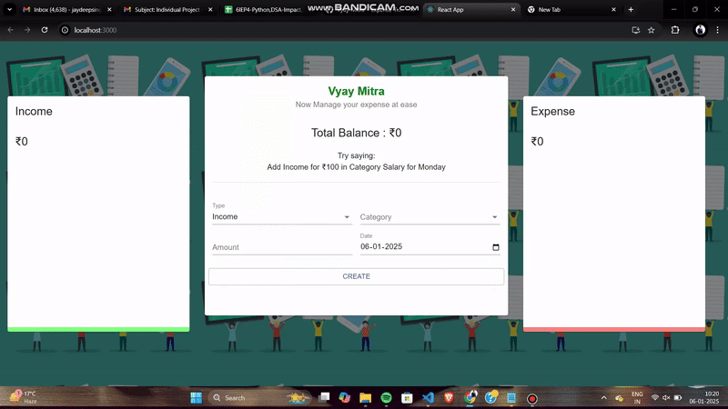

  <a href="" rel="noopener">
 

<h1 align = 'center'>   Vyay Mitra - Keep Records of Your Expenses.</h1>

### Description  ##

  Vyay Mitra is a simple expense tracker app which supports Tracking of your day to day Expenses. You can enter your incomes/expenses.It will help you to note,delete and categorize your incomes/expenses for easy budget management. It also has analyze charts for both income and expenses.

---

## Technologies Used ##

- JavaScript

- CSS

- React

- Material-UI

- Node.js

---
### Demo  ##

---

## Future Enhancements ##

- Addition of a Speech Recognition API for easy use without any typing.

- Integration with cloud services for data backup and synchronization across devices.

- Implementation of user authentication for secure access.

- Addition of multiple currency support for global users.

### Getting started ##
  
  Clone the repository and run `npm i` to install all the dependencies 
  Run `npm start` to start the react app 
  Navigate to `localhost:3000` on your browser

  If you get any error you can run these code directly :
  
  `$env:NODE_OPTIONS="--openssl-legacy-provider"` 
  `npm start`
